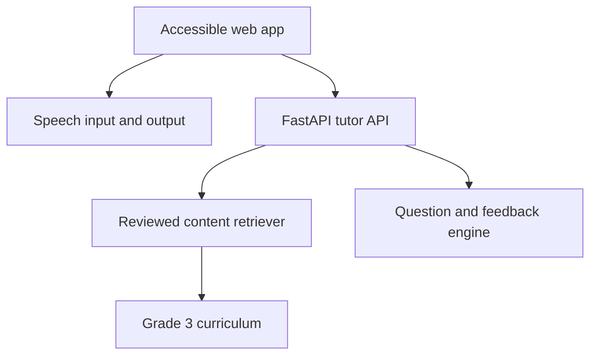

# MVP architecture

The MVP intentionally keeps retrieval deterministic and inspectable. A production release can replace the keyword retriever with multilingual embeddings and a vector database without changing the public API.

## Safety boundaries

- Answers must be grounded in teacher-approved curriculum chunks.
- The tutor says that content is unavailable instead of inventing an answer.
- No child voice recording or personal profile is persisted in this MVP.
- Group sessions require consent, identity separation, moderation, and data-retention controls before implementation.
- Accessibility mode is a preference, not a medical diagnosis.

## Planned production services

- Arabic OCR with equation-aware human review.
- Multilingual embeddings plus a vector store with page-level citations.
- Higher-quality Arabic speech-to-text and text-to-speech.
- Parent/teacher authentication and progress dashboards.
- Facilitated group sessions with turn-taking and child-safety controls.

